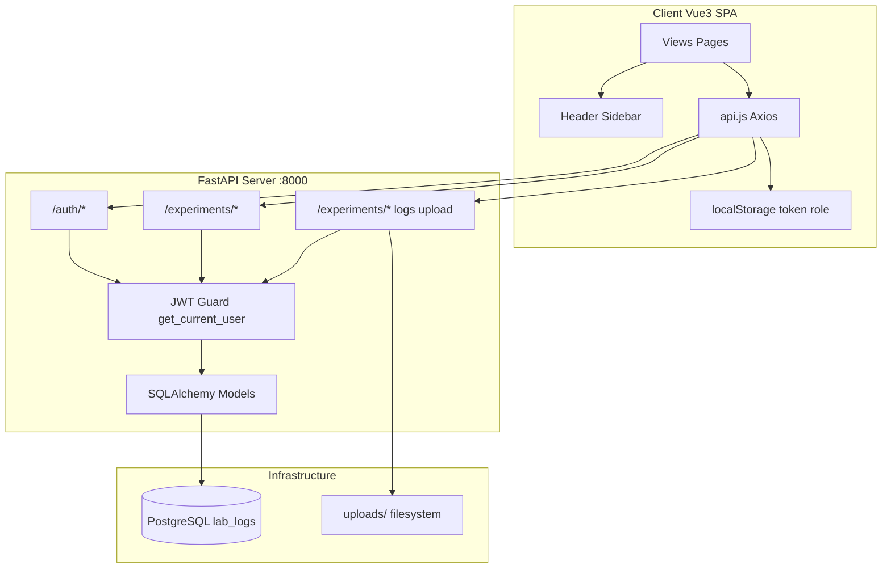
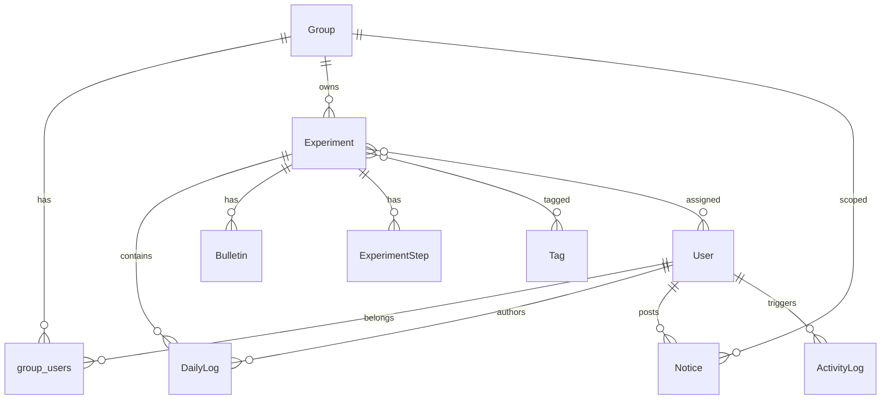

# Physics Lab Log 项目架构文档

## 1. 项目定位

**Physics Lab Log System** 是一个面向物理实验室的科研团队协作平台，采用前后端分离架构。核心能力包括：

- 多课题组（Research Group）管理与成员 roster
- 实验项目 CRUD、标签筛选、状态追踪
- 实验详情页：Markdown 文档、值班日志 Kanban、附件、操作步骤
- 全局/团队公告、活动审计日志
- JWT 认证 + 三级角色权限（`sys_admin` / `team_admin` / `member`）

---

## 2. 技术栈

| 层级 | 技术 |
|------|------|
| 前端 | Vue 3（Composition API + `<script setup>`）、Vue Router 5、Axios、Vite 8 |
| 后端 | FastAPI、SQLAlchemy ORM、Pydantic Schemas |
| 数据库 | PostgreSQL 15（Docker Compose 部署） |
| 认证 | JWT（python-jose）+ bcrypt 密码哈希 |
| 文件存储 | 本地 `server/uploads/` 目录 |

**默认运行端口：**

| 服务 | 端口 | 说明 |
|------|------|------|
| 前端 Vite Dev | `5173` | `client/` 目录下 `npm run dev` |
| 后端 FastAPI | `8000` | `client/src/services/api.js` 硬编码 `http://127.0.0.1:8000` |
| PostgreSQL | `5432` | 见根目录 `docker-compose.yml` |

---

## 3. 目录结构

```
physics-lab-log/
├── client/                    # Vue 3 SPA 前端
│   ├── src/
│   │   ├── main.js            # 入口：挂载 App + Router + 全局 CSS
│   │   ├── App.vue            # 根组件：router-view + ToastContainer
│   │   ├── router/index.js    # 路由与 auth guard
│   │   ├── services/api.js    # Axios 实例 + JWT 拦截器
│   │   ├── composables/useToast.js
│   │   ├── assets/main.css    # CSS 变量与全局 reset
│   │   ├── components/
│   │   │   ├── layout/        # Header.vue, Sidebar.vue
│   │   │   └── common/        # ToastContainer, ImageLightbox
│   │   └── views/             # 页面级组件（含 scoped 布局样式）
│   └── vite.config.js
├── server/                    # FastAPI 后端
│   ├── main.py                # 应用入口、CORS、路由挂载
│   ├── config/database.py     # PostgreSQL 连接
│   ├── models/                # SQLAlchemy ORM 实体
│   ├── schemas/               # Pydantic 请求/响应模型
│   ├── routers/               # auth / experiment / daily_log
│   ├── utils/security.py      # JWT + 密码工具
│   └── uploads/               # 附件与头像文件
├── docker-compose.yml         # 仅 Postgres 容器
└── ARCHITECTURE.md            # 本文档
```

> **说明：** 仓库根目录无统一的 `package.json` 或 `requirements.txt`，前后端需分别在 `client/` 与 `server/` 目录独立启动。

---

## 4. 系统架构



**请求链路：**

1. 用户登录 → `POST /auth/login` → JWT 存入 `localStorage`
2. Axios 拦截器自动附加 `Authorization: Bearer <token>`
3. 后端 `get_current_user` 解析 JWT，注入 `current_user`
4. 业务路由读写 PostgreSQL；附件经 `/experiments/upload` 落盘

---

## 5. 后端分层

### 5.1 入口 `server/main.py`

- 启动时 `Base.metadata.create_all()` 自动建表
- CORS 全开（开发模式，`allow_origins=["*"]`）
- 挂载三个 router：`auth`、`experiment`、`daily_log`

### 5.2 路由模块

#### `server/routers/auth.py` — 前缀 `/auth`

| 端点 | 功能 |
|------|------|
| `POST /register` | 注册（首个用户自动为 `sys_admin`） |
| `POST /login` | OAuth2 表单登录，返回 JWT |
| `GET /me` | 当前用户信息 |
| `PUT /profile` | 更新个人资料 |
| `PUT /profile/academic-identity` | 学术身份/头像 |
| `PUT /assign-team-admin` | 分配团队管理员 |
| `GET/POST /groups` | 课题组列表与创建 |
| `POST/DELETE /groups/{id}/members` | 成员加入/移除 |
| `GET /users` | 用户列表 |
| `PUT /users/{id}/role` | 角色变更 |
| `GET/PUT /system-settings/{key}` | 系统设置（如 `help_info`） |

#### `server/routers/experiment.py` — 前缀 `/experiments`

| 端点 | 功能 |
|------|------|
| `GET/POST ""` | 实验列表（按 `group_id`/`tag` 筛选）/ 创建 |
| `GET/PUT /{id}` | 实验详情 / 更新 |
| `PUT /{id}/members` | 实验参与人员 |
| `GET/POST /tags` | 全局标签 |
| `GET/POST/DELETE /{id}/bulletins` | 实验内公告 |
| `GET/POST/PUT/DELETE /{id}/steps` | 操作步骤清单 |
| `GET/POST/DELETE /intelligence/notices` | 仪表盘公告 |
| `GET /intelligence/activities` | 活动审计日志 |
| `GET /groups/{id}/members` | 团队成员 |

#### `server/routers/daily_log.py` — 前缀 `/experiments`

| 端点 | 功能 |
|------|------|
| `POST /upload` | 文件上传（50MB 限制） |
| `GET /attachments/{filename}` | 下载/预览（支持 query token） |
| `GET/POST /{id}/logs` | 值班日志 CRUD |
| `PUT /logs/{log_id}` | 编辑日志 |

### 5.3 数据模型关系



**核心实体：**

| 模型 | 文件 | 说明 |
|------|------|------|
| `User` / `Group` | `server/models/user.py` | 多对多（`group_users` 关联表），角色 `sys_admin \| team_admin \| member` |
| `Experiment` | `server/models/experiment.py` | 归属 Group，状态 `running \| paused \| stopped \| archived` |
| `Tag` | `server/models/experiment.py` | 全局标签，与实验多对多 |
| `Bulletin` | `server/models/experiment.py` | 实验级置顶通知 |
| `ExperimentStep` | `server/models/experiment.py` | 操作步骤勾选清单 |
| `DailyLog` | `server/models/daily_log.py` | 按 `shift_date` 分组，附件 JSON 序列化 |
| `Notice` / `ActivityLog` | `server/models/intelligence.py` | 仪表盘情报面板 |
| `SystemSetting` | `server/models/intelligence.py` | KV 配置（如帮助信息） |

---

## 6. 前端架构

### 6.1 路由 `client/src/router/index.js`

| 路径 | 组件 | 需登录 |
|------|------|--------|
| `/login` | Login.vue | 否 |
| `/register` | Register.vue | 否 |
| `/` | Dashboard.vue | 是 |
| `/experiment/:id` | ExperimentDetail.vue | 是 |
| `/team-members` | TeamMembers.vue | 是 |
| `/settings` | Settings.vue | 是（占位页） |

**Auth Guard：** 检查 `localStorage.token`，无 token 且目标路由 `meta.requiresAuth === true` 时重定向至 `/login`。

### 6.2 全局 Shell

`App.vue` 极简：`<router-view />` + 全局 `ToastContainer`。

**无统一 Layout 组件** — 各业务页自行组合 `Header` + `Sidebar` + `<main>`。

### 6.3 共享布局组件

**`Header.vue`** — 固定顶栏 64px

- 左：Logo + 标题（点击回首页）
- 中：搜索框（当前 disabled，占位）
- 右：角色徽章、用户头像/姓名、Logout
- 内置 Profile Modal（个人资料 + 安全设置 Tab）

**`Sidebar.vue`** — 固定左侧 240px

- 课题组下拉选择器（`All My Teams` / 具体 Group）
- 导航：Experiments Overview、Team Members
- 底部：北京/CERN 双时区时钟
- System Settings（跳转 `/settings` 占位页）
- `sys_admin` 可创建新 Group

**布局尺寸常量（全站一致）：**

| 元素 | 尺寸 |
|------|------|
| Header | 高度 `64px`，`position: fixed; top: 0` |
| Sidebar | 宽度 `240px`，`position: fixed; top: 64px` |
| 主内容区 | `margin-top: 64px; margin-left: 240px; height: calc(100vh - 64px)` |

---

## 7. 前端页面布局详解

### 7.1 认证页（Login / Register）

```
┌─────────────────────────────┐
│      auth-wrapper (居中)     │
│  ┌───────────────────────┐  │
│  │   auth-container      │  │
│  │   标题 + 表单 + 链接   │  │
│  └───────────────────────┘  │
└─────────────────────────────┘
```

- 无 Header/Sidebar
- 登录成功写入 `token`、`role`、`userName` 到 `localStorage`

### 7.2 仪表盘 Dashboard

```
┌──────────────────────────────────────────────────────────┐
│ Header (64px, fixed)                                      │
├────────┬─────────────────────────────────────────────────┤
│Sidebar │ main-content (padding 24/32)                      │
│ 240px  │ ┌─────────────────────┬──────────────────────┐  │
│ fixed  │ │ workspace-left      │ workspace-right      │  │
│        │ │ (flex:1)            │ (340px 固定宽)        │  │
│        │ │ - welcome banner    │ - Live Bulletins     │  │
│        │ │ - tag/status 筛选   │ - Recent Activities  │  │
│        │ │ - 实验卡片 grid     │ - Help & Support     │  │
│        │ └─────────────────────┴──────────────────────┘  │
└────────┴─────────────────────────────────────────────────┘
max-width: 1400px 居中
```

**左侧主区：**

- 欢迎横幅
- Tags / Status 双行 Pill 筛选
- 实验卡片网格（点击跳转 `/experiment/:id`）
- admin 可创建 Tag、New Experiment（需选定具体 Group）

**右侧情报栏（340px，独立滚动）：**

- Live Bulletins & Notices（系统/团队公告）
- Recent Activities 时间线
- Help & Support（`sys_admin` 可编辑，存 `SystemSetting`）

### 7.3 实验详情 ExperimentDetail

```
┌──────────────────────────────────────────────────────────┐
│ Header                                                    │
├────────┬─────────────────────────────────────────────────┤
│Sidebar │ detail-main                                       │
│        │ ┌─ exp-meta-bar (标题/状态/标签/编辑) ─────────┐ │
│        │ └──────────────────────────────────────────────┘ │
│        │ workspace-split                                  │
│        │ ┌─────────────────────┬──────────────────────┐  │
│        │ │ canvas-center       │ utility-dock (340px) │  │
│        │ │ (垂直滚动)           │ (独立滚动)            │  │
│        │ │ 1. Overview Doc     │ - Operational Steps  │  │
│        │ │ 2. Bulletins        │ - All Attachments    │  │
│        │ │ 3. Current Task     │ - Image Gallery      │  │
│        │ │ 4. Daily Log Kanban │                      │  │
│        │ │ 5. Personnel +      │                      │  │
│        │ │    Leaderboard      │                      │  │
│        │ └─────────────────────┴──────────────────────┘  │
└────────┴─────────────────────────────────────────────────┘
```

**canvas-center 五大板块（自上而下）：**

1. **Detailed Overview** — Markdown/纯文本，默认折叠，可编辑
2. **Urgent Bulletins** — 实验级置顶通知
3. **Currently Executing Task** — 当前执行任务
4. **Daily Log Kanban** — 按 `shift_date` 分列的横向 Kanban，含附件预览
5. **Assigned Personnel** — 参与人员 + 贡献排行榜（ops/atts）

**utility-dock 右侧面板：**

- Operational Steps 勾选清单
- All Experiment Attachments 列表（Trace 回溯到日志）
- Image Gallery 缩略图网格

大量 Modal 通过 `<Teleport to="body">` 挂载（编辑元信息、日志详情、人员管理、PDF 预览等）。

### 7.4 团队成员 TeamMembers

```
Header + Sidebar + team-main-content
  └── team-container-box
        ├── team-view-banner（Group 范围 + 人数 + Add Member）
        └── members-card-grid（成员卡片网格）
              └── 点击打开详情 Modal
```

- 需选择具体 Group（`activeGroupId !== 0`）才显示该组成员；`All My Teams` 模式拉取全量用户
- admin 可添加/移除成员、查看学术档案

### 7.5 系统设置 Settings（占位页）

```
Header + Sidebar + settings-main-content
  └── settings-placeholder（"System Settings - coming soon"）
```

---

## 8. 样式体系

`client/src/assets/main.css` 定义 CSS 变量：

- 背景：`--bg-primary`（`#f8fafc`）、`--bg-surface`（`#fff`）
- 主色：`--primary-color`（`#2563eb`）
- 圆角/阴影：`--radius-md`、`--shadow-sm/md`

**布局策略：**

- `html, body, #app` 均 `height: 100%; overflow: hidden`（整页不滚动）
- 滚动发生在各页面内部的 `workspace-right`、`canvas-center`、`utility-dock`
- 各 View 的 scoped CSS 自包含布局（未抽取公共 layout 类到 `main.css`）

---

## 9. 权限模型（前端侧）

| 角色 | 典型能力 |
|------|----------|
| `member` | 只读为主，不可创建实验/日志/公告 |
| `team_admin` | 团队内创建实验、发公告、管理成员 |
| `sys_admin` | 全量数据、创建 Group、发系统级公告、编辑 Help |

前端通过 `localStorage.role` + 后端 403 双重约束；UI 用 `v-if="userRole !== 'member'"` 隐藏操作按钮。

---

## 10. 关键设计特点与已知缺口

**特点：**

- 页面级布局自包含，Header/Sidebar 作为 dumb 组件通过 props/emit 通信
- 实验详情页信息密度高，Kanban + 附件 + 步骤 + 公告一体化
- `ActivityLog` 自动审计关键操作

**已知缺口：**

- `/settings` 已注册路由，但仅为占位页，功能尚未实现
- Header 搜索框 disabled
- 无根级 `package.json` / `requirements.txt`，前后端需分别启动
- API `baseURL` 硬编码，无环境变量配置

---

## 11. 本地启动流程

```bash
# 1. 启动数据库
docker compose up -d

# 2. 启动后端
cd server && source venv/bin/activate && uvicorn main:app --reload

# 3. 启动前端
cd client && npm run dev
```

访问前端：`http://localhost:5173`  
API 文档（FastAPI 自动生成）：`http://127.0.0.1:8000/docs`
