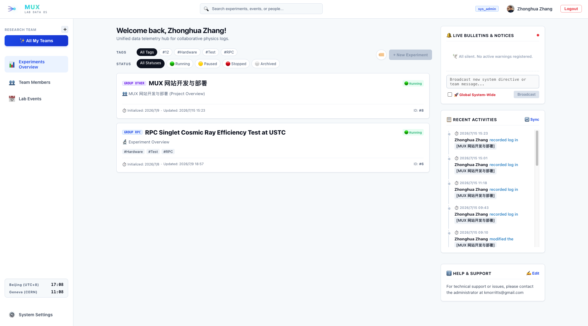
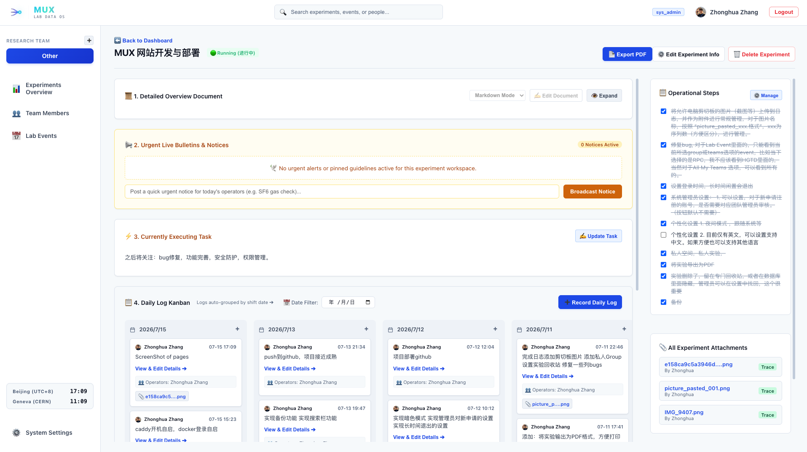
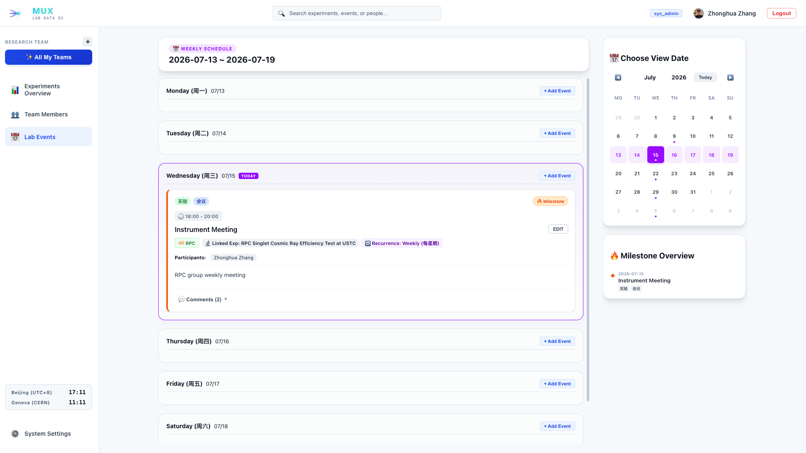
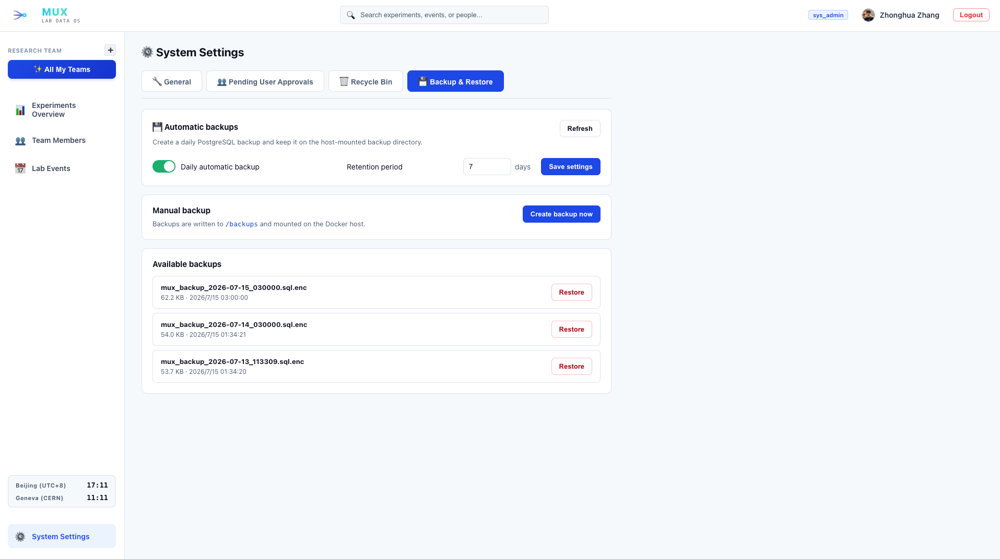

<p align="right">
  <a href="#简体中文"></a>
</p>

<div align="center">
  
  <h1>MUX Lab Log</h1>
  <p><strong>A secure, self-hosted research operations workspace for modern physics laboratories.</strong></p>
  <p>Experiments, shift logs, schedules, files, and team knowledge — organized in one place.</p>

  <p>
    
    
    
    
    <a href="https://opensource.org/license/mit"></a>
  </p>
</div>

---

## One workspace for the full experimental lifecycle

MUX Lab Log gives research teams a shared operational memory. It replaces disconnected documents, chat messages, paper logbooks, and spreadsheets with a structured workspace built around real laboratory workflows.

| Capability | What your team gets |
|------------|--------------------|
| **Experiment workspaces** | Markdown documentation, status tracking, tags, operational steps, bulletins, assigned personnel, and a recycle bin |
| **Shift logbook** | Date-based Kanban logs, participant records, clipboard image upload, file previews, traceability, and contribution summaries |
| **Laboratory calendar** | Weekly timeline, recurring events, experiment links, participants, comments, important-event highlighting, and attachments |
| **Research groups** | Multiple isolated teams, private workspaces, member profiles, registration approval, and three administrative roles |
| **Knowledge export** | On-demand PDF generation with experiment documentation, logs, images, and embedded multilingual fonts |
| **Operations** | Activity auditing, system settings, encrypted scheduled backups, retention controls, health checks, and versioned migrations |

### Designed for collaboration

- Keep experiment context, current tasks, operating procedures, and daily observations together.
- Give every shift a consistent record while preserving authorship and attachment provenance.
- Navigate across experiments, people, events, notices, and recent activity without losing group context.
- Support international teams with English/Chinese UI, light/dark/system themes, and multilingual PDF output.
- Preserve historical records with soft deletion, administrator recovery, audit trails, and encrypted backups.

## See MUX in action

<table>
  <tr>
    <td width="50%" valign="top">
      <a href="exhibition/MainPage.png"></a>
      <br><strong>Unified dashboard</strong><br>
      Experiments, status filters, live notices, and recent activity in one team-aware view.
    </td>
    <td width="50%" valign="top">
      <a href="exhibition/ExperimentPage.png"></a>
      <br><strong>Experiment workspace</strong><br>
      Documentation, tasks, bulletins, shift logs, files, personnel, and PDF export together.
    </td>
  </tr>
  <tr>
    <td width="50%" valign="top">
      <a href="exhibition/EventPage.png"></a>
      <br><strong>Laboratory schedule</strong><br>
      Weekly planning with recurring events, milestones, linked experiments, participants, and comments.
    </td>
    <td width="50%" valign="top">
      <a href="exhibition/SettingPage.png"></a>
      <br><strong>System administration</strong><br>
      Registration approvals, recycle-bin controls, backup policies, and encrypted snapshot inventory.
    </td>
  </tr>
</table>

## Security is part of the architecture

MUX is built for multi-team environments where one research group must never gain accidental access to another group’s work.

- **Tenant-scoped authorization** — experiments, logs, events, members, notices, and attachments are filtered by accessible research groups in server-side queries.
- **Secure browser sessions** — short-lived JWTs use `HttpOnly`, `SameSite` cookies with CSRF protection; access tokens are never placed in URLs or browser `localStorage`.
- **Hardened uploads** — UUID storage names, path-boundary checks, content-signature detection, SHA-256 hashes, ownership metadata, and group-aware downloads.
- **Safe rich text** — Markdown rendering disables raw HTML, closing the stored-XSS path from experiment descriptions.
- **Least-privilege database access** — runtime CRUD, backup, and migration identities are separated; Web workers cannot create databases, roles, or replication slots.
- **Defence in depth** — non-root application containers, database constraints, scoped indexes, security headers, rate limiting, and auditable administrative actions.
- **Encrypted backups** — scheduled single-database dumps are encrypted with AES-256-CBC/PBKDF2; online restore is intentionally excluded from the Web security boundary.

For the complete security and runtime model, see [ARCHITECTURE.md](ARCHITECTURE.md).

## Deploy in minutes

### Requirements

- Git
- Docker Engine with Docker Compose v2
- Node.js and npm for the production frontend build
- OpenSSL for credential generation and encrypted backups

### Install

```bash
git clone https://github.com/ZhangZhHua/MUX.git
cd MUX
./deploy.sh
```

Open [http://localhost:18080](http://localhost:18080). The first registered account becomes the system administrator.

The deployment command builds the frontend and non-root application image, provisions least-privilege database roles, runs Alembic migrations, takes an encrypted pre-deployment snapshot when upgrading, and starts the Web, PostgreSQL, and scheduler services.

### Verify the installation

```bash
docker compose --env-file .env.prod ps
docker compose --env-file .env.prod logs -f mux-app mux-scheduler
```

A healthy installation reports `mux-db` and `mux-app` as healthy, with the scheduler running independently.

## First-run checklist

Before inviting the team:

1. **Claim the administrator account immediately.** The first registered user becomes `sys_admin`; complete this step before exposing a new instance to untrusted networks.
2. **Review `.env.prod`.** `deploy.sh` generates missing secrets, but you should securely retain `SECRET_KEY`, database passwords, and `BACKUP_ENCRYPTION_KEY` outside the server.
3. **Use HTTPS in production.** Keep the application bound to loopback behind a trusted TLS terminator, set `COOKIE_SECURE=true`, and set `CORS_ORIGINS` to the exact HTTPS origin.
4. **Configure onboarding.** Enable registration approval, create research groups, assign team administrators, and verify membership before importing records.
5. **Protect persistent data.** Back up the PostgreSQL volume, `server/uploads`, and encrypted `backups` directory to independent storage.
6. **Test recovery.** Keep restores as an offline owner-only procedure and periodically verify backups in an isolated environment.

## Everyday administration

```bash
# Apply updates, create a pre-deployment backup, migrate, and restart
./deploy.sh

# Inspect all services
docker compose --env-file .env.prod ps

# Follow application logs
docker compose --env-file .env.prod logs -f mux-app

# Follow scheduled backup activity
docker compose --env-file .env.prod logs -f mux-scheduler
```

Automatic backups run daily at 03:00 by default. System administrators can enable or disable the schedule and set the retention period from the application settings.

## Technology

- **Frontend:** Vue 3 · Vue Router · Vite · Axios · markdown-it · pdfmake
- **Backend:** FastAPI · Pydantic · SQLAlchemy · Gunicorn · Uvicorn
- **Data:** PostgreSQL 15 · Alembic
- **Infrastructure:** Docker Compose · Nginx · APScheduler

## Documentation

- [Architecture and security model](ARCHITECTURE.md)
- [Production environment template](.env.prod.example)
- [Docker Compose services](docker-compose.yml)

## Author, copyright, and license

MUX Lab Log is created and maintained by **ZhangZhHua**.

- GitHub: [@ZhangZhHua](https://github.com/ZhangZhHua)
- Email: [kmorritts@gmail.com](mailto:kmorritts@gmail.com)
- Repository: [github.com/ZhangZhHua/MUX](https://github.com/ZhangZhHua/MUX)

Copyright © 2026 ZhangZhHua. Released under the [MIT License](https://opensource.org/license/mit).

---

## 简体中文

<div align="center">
  <h2>MUX 实验室日志系统</h2>
  <p><strong>面向现代物理实验室的安全、自托管科研协作与运行记录平台。</strong></p>
</div>

MUX 将实验文档、每日值班日志、实验室日程、附件和团队管理集中到一个清晰的工作空间，帮助课题组建立连续、可追溯、可检索的实验记忆。

### 核心能力

- **实验工作空间：** Markdown 文档、标签、状态、操作步骤、公告、成员分配与回收站。
- **值班日志：** 日期看板、参与者、截图粘贴、附件预览、来源回溯与贡献统计。
- **实验室日程：** 周视图、重复事件、参与人员、评论、重要事件与实验关联。
- **多课题组协作：** 数据按组隔离，支持私人空间、成员档案、注册审批和三级角色。
- **知识输出：** 按需生成包含文档、日志、图片和中文字体的实验 PDF。
- **可靠运维：** 活动审计、版本化迁移、健康检查、独立调度器和加密备份。

### 安全保障

- 服务端按课题组执行资源授权，防止跨组读取和修改。
- JWT 使用 HttpOnly Cookie，并配套 CSRF 防护，不进入 URL 或 localStorage。
- 上传文件使用 UUID、真实文件签名、SHA-256、路径校验和所有权记录。
- Markdown 禁止原始 HTML，阻断持久型 XSS。
- Web、备份和迁移数据库账号分离，应用容器以非 root 用户运行。
- 数据库约束、访问索引、安全响应头、限流和审计日志共同提供纵深防护。
- 备份经过加密；数据库恢复保留为离线、owner-only 运维流程。

### 快速部署

准备 Git、Docker Compose v2、Node.js/npm 和 OpenSSL：

```bash
git clone https://github.com/ZhangZhHua/MUX.git
cd MUX
./deploy.sh
```

打开 [http://localhost:18080](http://localhost:18080)，第一个注册账号将成为系统管理员。

正式投入使用前，请先完成管理员注册，妥善保管 `.env.prod` 中的密钥，为生产环境配置 HTTPS、`COOKIE_SECURE=true` 和准确的 `CORS_ORIGINS`，启用注册审批，并将数据库、上传目录和加密备份复制到独立存储。

详细架构与安全设计请阅读 [ARCHITECTURE.md](ARCHITECTURE.md)。

### 作者与版权

- 作者及维护者：**ZhangZhHua**
- GitHub：[@ZhangZhHua](https://github.com/ZhangZhHua)
- 邮箱：[kmorritts@gmail.com](mailto:kmorritts@gmail.com)
- 项目地址：[github.com/ZhangZhHua/MUX](https://github.com/ZhangZhHua/MUX)

Copyright © 2026 ZhangZhHua. 本项目采用 [MIT License](https://opensource.org/license/mit) 发布。
